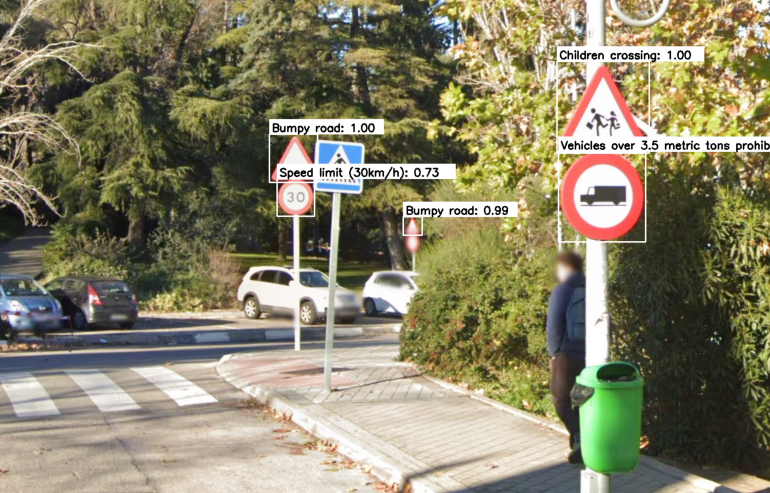

# 🚦 Traffic Sign Detection and Classification

[](LICENSE)
[](https://www.python.org/)
[](https://www.tensorflow.org/)
[](https://github.com/ultralytics/ultralytics)

> Detecting and classifying traffic signs using deep learning techniques for autonomous driving and driver-assistance systems.



---

## 📄 Overview

**Traffic Sign Detection and Classification** is a computer vision project that combines object detection and image classification techniques to build a robust perception system for **autonomous vehicles**.  
The system first detects traffic signs in real-world road scenes using **YOLOv8**, and then classifies each detected sign using a custom **Convolutional Neural Network (CNN)** trained on the **GTSRB dataset** .

Developed as part of the **Data Science and Artificial Intelligence degree at Universidad Politécnica de Madrid**, this project evaluates the performance, robustness, and generalization of multiple CNN architectures, with preprocessing and augmentation strategies designed to enhance real-world applicability.

---

## 🎯 Objectives

- Detect traffic signs from real-world images using pre-trained **YOLOv8** models.  
- Classify detected signs into their corresponding categories using **CNNs** trained on **GTSRB**.  
- Improve generalization through **CLAHE preprocessing**, **grayscale conversion**, and **data augmentation**.  
- Test system performance on unseen Spanish traffic signs and real images from **Google Earth / Street View**.  

---

## 🧩 Methodology

The project follows a **two-stage pipeline**: detection → classification.

3. **Data Preprocessing**
   - Resized to 50×50 px.
   - Normalization between 0 and 1.
   - **CLAHE**: Enhanced image contrast for better visibility under poor lighting.
   - **Grayscale conversion**: Focused on shape rather than color.
   - **Data Augmentation**: Rotation, scaling, flipping, and brightness variation to balance underrepresented classes.

4. **Traffic Sign Detection (YOLOv8)**
   - Three pre-trained YOLO models were evaluated for detection accuracy and completeness.
   - Images from Google Street View (Campus Sur, UPM) were used for testing real-world detection.


    | Model | Description | Results |
    |--------|--------------|----------|
    | [pkdarabi/traffic-signs-detection-using-yolov8](https://www.kaggle.com/code/pkdarabi/traffic-signs-detection-using-yolov8) | Detects speed limit signs | Partial detection |
    | [phillipssempeebwa/yolov8-road-sign-detection](https://www.kaggle.com/models/phillipssempeebwa/yolov8-road-sign-detection?select=best.pt) | Detects warning and prohibition signs | Partial coverage |
    | [duy18102004/traffic-detection-with-yolov8](https://www.kaggle.com/code/duy18102004/traffic-detection-with-yolov8) | Detects multiple types of traffic signs | ✅ *Final selected model* |

   - The **third YOLOv8 model** successfully detected all visible traffic signs and was chosen for deployment.

5. **Traffic Sign Classification (CNNs)**
   - Four CNN models were trained and evaluated on the **GTSRB** dataset (43 classes, >50,000 images).
   - Each model used progressively more complex architectures and preprocessing strategies.

   | Model | Architecture | Techniques | Accuracy (Validation) | Observations |
   |:------|:--------------|:--------------|:----------------------|:--------------|
   | 1️⃣ CNN-1 | 3 Conv + 2 Dense layers | Basic normalization | 98% | High accuracy, poor generalization |
   | 2️⃣ CNN-2 | 4 Conv + BatchNorm + Dropout | One-hot enconding | 98% | Slight overfitting |
   | 3️⃣ CNN-3 | Same as CNN-2 | **CLAHE + Grayscale + Data Augmentation** | **>98% (Best)** | Excellent real-world results |
   | 4️⃣ CNN-4 | ResNet50 (Transfer Learning) | Fine-tuning | 60% | Poor generalization to Spanish signs |

6. **Evaluation**
   - Validation on held-out GTSRB data and unseen Spanish road sign images.
   - Metrics: Accuracy.
   - Loss: Categorical Crossentropy.
   - Real-world validation with images and video captured from Campus Sur, UPM.

---

## 📊 Results

- **YOLOv8** achieved complete detection of all traffic signs in test scenes.  
- **CNN-3 (CLAHE + grayscale)** obtained the best accuracy and generalization on unseen data.  
- Combined **YOLOv8 + CNN-3** produced accurate and consistent predictions in video frames.

| Metric | YOLOv8 (Detection) | CNN (Classification) |
|---------|--------------------|----------------------|
| Detection Precision | >95% on real-world images | — |
| Accuracy (Validation) | — | 98.2% |
| Overfitting | Not noticeable | Moderate in simpler models |
| Robustness on Real Images | High | High with CLAHE |

The final system **successfully detected and classified almost all Spanish traffic signs**, demonstrating strong generalization ability despite being trained on German signs.

---

## 🔍 Conclusions

- The proposed two-stage approach effectively detects and classifies traffic signs in real-world conditions.  
- Image enhancement (CLAHE) and balanced data augmentation were crucial for improving model robustness.  
- Transfer learning (ResNet50) did not outperform custom CNNs due to domain mismatch between German and Spanish signs.  
- Future improvements should include:
  - Fine-tuning YOLO on localized datasets (Spanish traffic signs).  
  - Testing with **Vision Transformers (ViT)** for classification.  
  - Optimizing inference for embedded systems (e.g., **NVIDIA Jetson**, **TensorRT**).  

---

## 🧰 Technologies Used

- **Python 3.10**
- **TensorFlow / Keras**
- **Ultralytics YOLOv8**
- **OpenCV, NumPy, Pandas, tqdm**
- **Matplotlib**
- **Jupyter Notebook**

---

## 📁 Repository Structure

```
Traffic-Sign-Detection-and-Classification/
│
├── data/
│ ├── label_names.csv
│
├── demo/
│ ├── output.png
│
├── docs/
│ ├── Paper.pdf
│ └── Slides.pdf
│
├── models/
│ ├── CNN/
│ │ ├── clahe_bw.pkl
│ │ ├── clahe_bw.zip
│ │ ├── Resnet.keras
│ │ ├── Resnet.pkl
│ │ ├── traffic_sign_best_model.pkl
│ │ ├── traffic_sign_best_model.zip
│ │ ├── traffic_sign_model.keras
│ │ └── traffic_sign_model.pkl
│ │
│ └── YOLO/
│   ├── approach1.pt
│   ├── approach2.pt
│   └── approach3.pt
│
├── notebooks/
│ ├── traffic_sign.ipynb
│ └── traffic_sign.pdf
│
├── .gitignore
├── LICENSE
├── README.md
└── requirements.txt
```

---

## 📚 References

1. Bochkovskiy, A. et al. (2020). *YOLOv4: Optimal Speed and Accuracy of Object Detection* — arXiv.  
2. Tan, M. & Le, Q. (2020). *EfficientNet: Rethinking Model Scaling for CNNs* — arXiv.  
3. He, K. et al. (2015). *Deep Residual Learning for Image Recognition (ResNet)* — arXiv.  
4. Khanam, R., & Hussain, M. (2024). *What is YOLOv5: A Deep Look into the Internal Features of the Popular Object Detector*.  
5. Ji, B. et al. (2024). *Improved YOLOv8 for Small Traffic Sign Detection under Complex Conditions* — *Franklin Open*.  
6. Mykola, G. (2024). *GTSRB – German Traffic Sign Recognition Benchmark* — [Kaggle Dataset](https://www.kaggle.com/datasets/meowmeowmeowmeowmeow/gtsrb-german-traffic-sign/data).  

---

## 👤 Author

**Raúl Andrino & Antonio Reviejo**  
Universidad Politécnica de Madrid  
📧 Contact: [raulandrino90@gmail.com], [arevi10.AR@gmail.com]  
📘 Project for: *Data Science and Artificial Intelligence Degree*  

---

## ⚖️ License

This project is licensed under the **MIT License** — feel free to use, modify, and share for research or educational purposes.

---

⭐ *If you find this project useful, consider giving it a star on GitHub!*